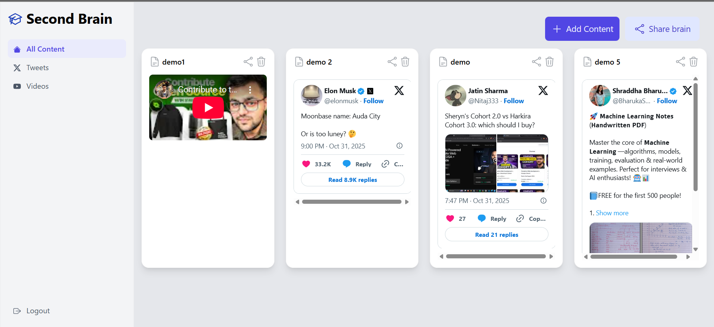
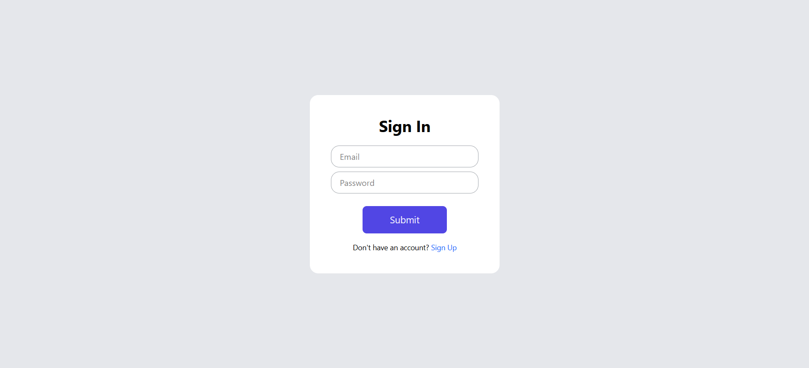
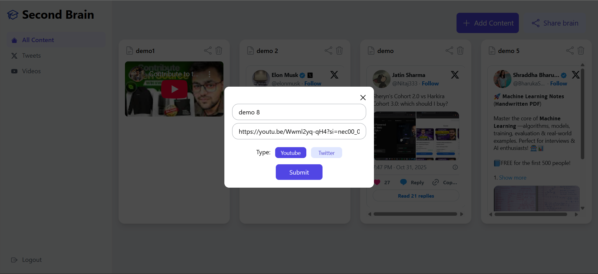

# Second Brain App 🧠

A full-stack application that allows users to save and organize their favorite content from YouTube and Twitter/X. Built with React, TypeScript, Node.js, Express, and MongoDB.

## Screenshots 📸

### Dashboard

*Main dashboard showing saved YouTube videos and tweets*

### Sign Up

*User registration page with validation*

### Sign In

*Secure login page*

### Add Content Modal

*Modal for adding YouTube or Twitter content*

## Features ✨

- 📝 **User Authentication** - Secure signup/signin with JWT and bcrypt
- 🎥 **YouTube Integration** - Save and embed YouTube videos
- 🐦 **Twitter/X Integration** - Save and embed tweets
- 🗑️ **Content Management** - Add, view, and delete saved content
- 🎨 **Modern UI** - Clean interface built with Tailwind CSS
- 🔒 **Protected Routes** - Authentication-based access control

## Tech Stack 💻

### Frontend
- **React 19** - UI library
- **TypeScript** - Type safety
- **Vite** - Build tool
- **Tailwind CSS 4** - Styling
- **React Router 7** - Routing
- **Axios** - HTTP client

### Backend
- **Node.js** - Runtime
- **Express 5** - Web framework
- **TypeScript** - Type safety
- **MongoDB** - Database
- **Mongoose** - ODM
- **JWT** - Authentication
- **Bcrypt** - Password hashing
- **Zod** - Input validation
- **Cookie Parser** - Cookie handling
- **CORS** - Cross-origin requests

## Prerequisites 📋

- Node.js (v18 or higher)
- MongoDB (local or Atlas)
- npm or yarn

## Installation 🚀

### 1. Clone the Repository

```bash
git clone https://github.com/MehulSharma-259/second-brain-app.git
cd second-brain-app
```

### 2. Backend Setup

```bash
cd second-brain-app-backend
npm install
```

Create a `.env` file in the backend directory:

```env
PORT=8000
MONGO_URL=mongodb://localhost:27017/second-brain
JWT_SECRET_USER=your-super-secret-jwt-key-here
JWT_SECRET_ADMIN=your-admin-secret-key-here
```

**Important:** Replace the JWT secrets with your own secure random strings.

Start the backend:

```bash
npm run dev
```

### 3. Frontend Setup

```bash
cd second-brain-app-frontend
npm install
```

Start the frontend:

```bash
npm run dev
```

The app will be available at `http://localhost:5173`

## Project Structure 📁

```
second-brain-app/
├── second-brain-app-backend/
│   ├── src/
│   │   ├── db.ts                 # Database models
│   │   ├── index.ts              # Main server file
│   │   ├── middlewares/
│   │   │   └── auth.ts           # Authentication middleware
│   │   └── utils/
│   │       ├── dbConnection.ts   # Database connection
│   │       ├── interfaces.ts     # TypeScript interfaces
│   │       └── jwt.ts            # JWT utilities
│   ├── package.json
│   ├── tsconfig.json
│   └── .env
│
└── second-brain-app-frontend/
    ├── src/
    │   ├── components/
    │   │   ├── icons/            # SVG icon components
    │   │   └── ui/               # Reusable UI components
    │   ├── hooks/
    │   │   └── useContents.tsx   # Custom hook for fetching content
    │   ├── pages/
    │   │   ├── Dashboard.tsx     # Main dashboard
    │   │   ├── Signin.tsx        # Sign in page
    │   │   └── Signup.tsx        # Sign up page
    │   ├── App.tsx               # Main app component
    │   ├── main.tsx              # Entry point
    │   └── index.css             # Global styles
    ├── config.ts                 # Backend URL configuration
    ├── package.json
    └── tsconfig.json
```

## API Endpoints 🔌

### Authentication

- `POST /api/v1/signup` - Register a new user
- `POST /api/v1/signin` - Login user
- `POST /api/v1/logout` - Logout user

### Content Management (Protected)

- `POST /api/v1/content` - Add new content
- `GET /api/v1/content` - Get all user content
- `DELETE /api/v1/content` - Delete content by ID


## Usage Guide 📖

### Adding Content

1. Click the **"Add Content"** button on the dashboard
2. Enter a title for your content
3. Paste the URL:
   - **YouTube:** Any youtube.com, youtu.be, or shorts URL
   - **Twitter/X:** Any twitter.com or x.com status URL
4. Select the content type (YouTube or Twitter)
5. Click **"Submit"**

### Viewing Content

- All saved content appears as cards on the dashboard
- YouTube videos are embedded and playable
- Tweets are embedded with full functionality
- Click the share icon to open the original source
- Click the delete icon to remove content

### Authentication

- Passwords must be at least 8 characters
- Must contain uppercase, lowercase, and special characters
- Sessions are maintained via HTTP-only cookies
- Click "Logout" in the sidebar to sign out

## Environment Variables 🔐

### Backend (.env)

| Variable | Description | Example |
|----------|-------------|---------|
| `PORT` | Server port | `8000` |
| `MONGO_URL` | MongoDB connection string | `mongodb://localhost:27017/second-brain` |
| `JWT_SECRET_USER` | Secret key for user JWT | `your-secret-key` |
| `JWT_SECRET_ADMIN` | Secret key for admin JWT | `your-admin-key` |

### Frontend (config.ts)

| Variable | Description | Example |
|----------|-------------|---------|
| `DB_URL` | Backend API URL | `http://localhost:8000` |

## Database Schema 💾

### User
```typescript
{
  firstName: String (required)
  lastName: String (required)
  email: String (unique, required)
  password: String (required, hashed)
}
```

### Content
```typescript
{
  link: String (unique)
  type: "youtube" | "twitter" (required)
  title: String (unique, required)
  tags: [ObjectId] (references Tag)
  userId: ObjectId (references User, required)
}
```

### Link (for sharing)
```typescript
{
  hash: String (unique)
  userId: ObjectId (references User, required, unique)
}
```

### Tag
```typescript
{
  title: String (required, unique)
}
```

## Security Features 🔒

- Password hashing with bcrypt (5 rounds)
- HTTP-only cookies for JWT storage
- CORS configuration for frontend origin
- Input validation with Zod
- Protected API routes with authentication middleware
- MongoDB injection prevention via Mongoose


Made with ❤️ using React and TypeScript